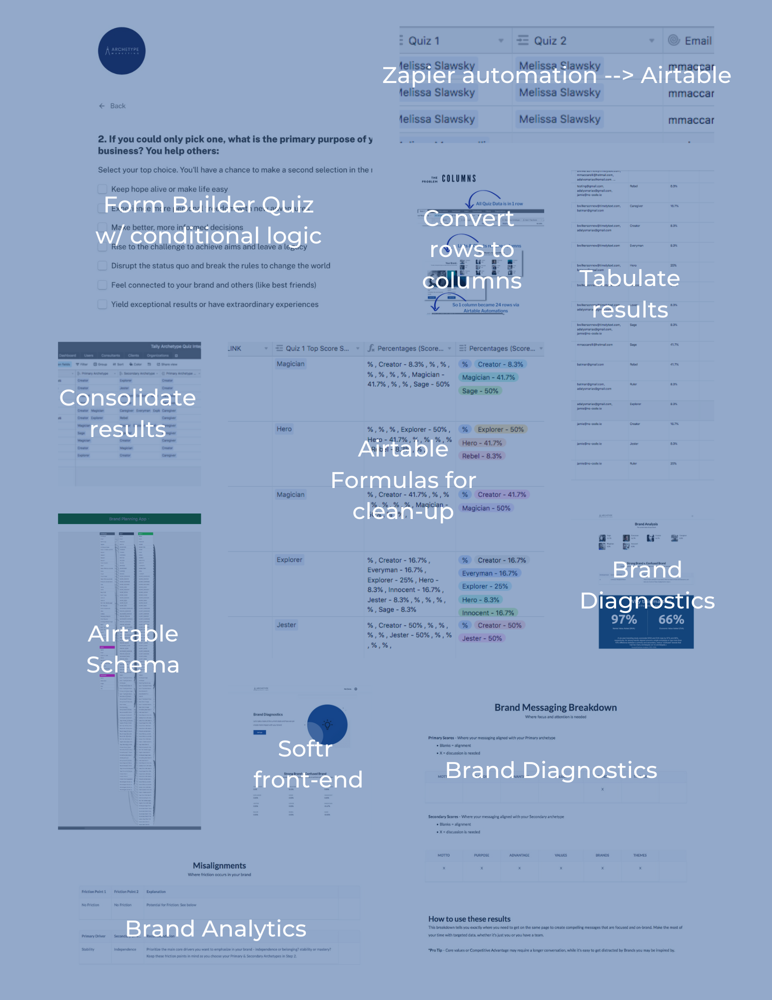
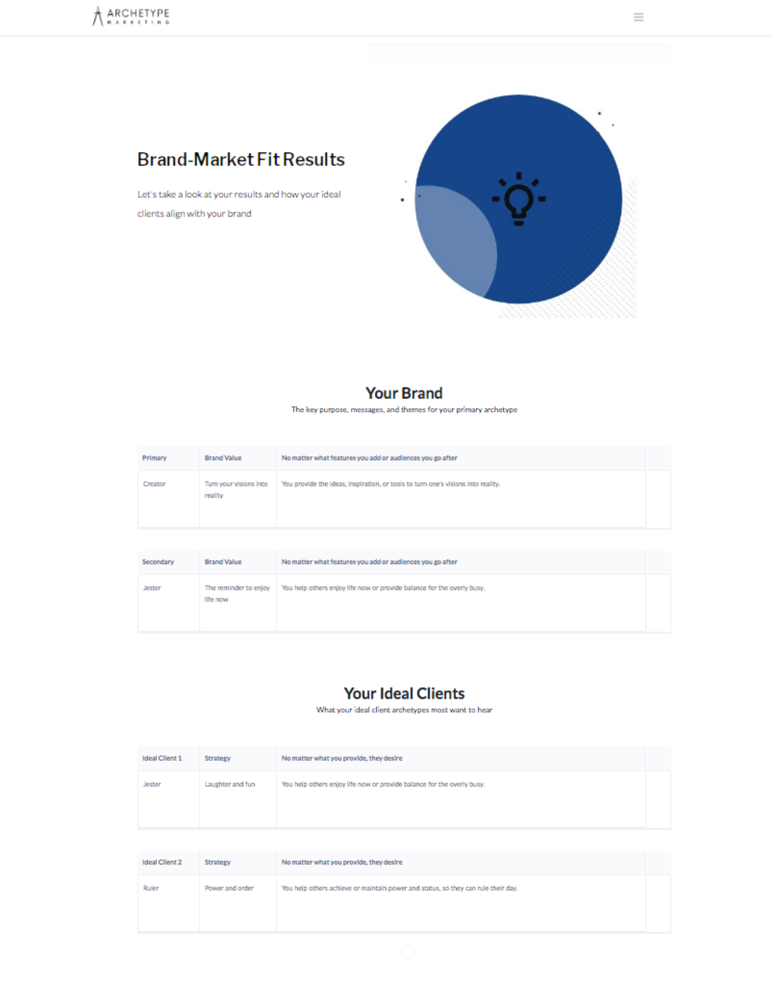
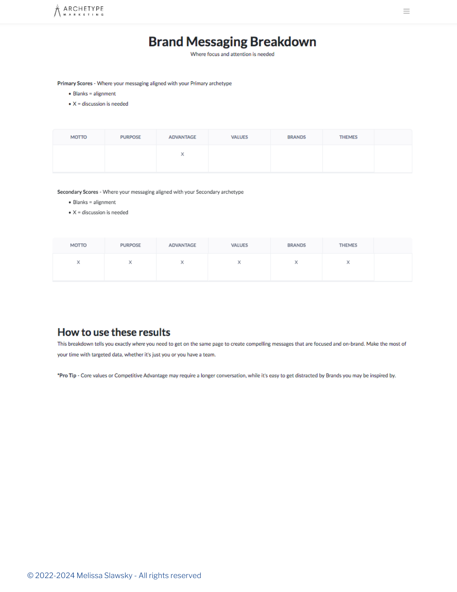

# Consumer Insights & Analytics: Aligning Business Value with User Needs  

**Showcasing the Evolution and Journey**  
This repository offers an overview of a solution for **Consumer Insights & Analytics**, highlighting key milestones from service design optimization to real-time analytics with qualitative consumer insights.

---

## Project Evolution  

### Phase 1: Consulting Automation
- Automated key consulting processes to improve efficiency and scalability.
- Introduced decision-tree models to simplify service optimization.

### Stage 1: Service Design & Optimization (2021)

- Focused on aligning business goals with user needs through advisory planning, brand development, and content strategy.
- Delivered service design blueprints and optimization plans to drive efficiency without sacrificing on customer experience.

  
  

[View Case Study](https://www.flipsnack.com/F899E588B7A/casestudy_scalingdigitalservices/full-view.html)

---

### Stage 2: Tech-Enabled Consulting Prototype (2022)  

- Developed initial frameworks for tech-enabled consulting using Airtable and no-code tools.
- Built workflows for capturing and categorizing consumer insights for early analysis.

  
  

---

### Stage 3: Alignment Prototype (2023)  

- Created tools to align business value to user needs, streamlining consulting processes
- Integrated alignment algorithms to facilitate purpose-driven growth strategies.

  
  
  

---

### Phase 2: Real-Time Analytics & Decision Engine
- Introducing models for transforming qualitative user feedback into quantitative insights.
- Establishing real-time feedback loops for adaptive decision-making.

### Stage 5: Data-Driven Insights (2023-2024)  
- Transitioned to advanced analytics for deeper exploration of consumer behavior.
- Built dynamic analytics reports to provide actionable insights and uncover trends.

  
  

---

### Stage 6: Machine Learning & AI Integration (2024)  

- Incorporating machine learning models to predict consumer behavior and preferences
- Building AI-driven tools for optimizing resource allocation and engagement strategies

  
  
  

---

### Stage 7: Intuitive Visualizations with Variance Loops (2024)  
- Designing strategic variance loops for actionable visualizations
- Enabling users to interact with and understand complex data effortlessly

  
  

---

## Contact  
- [LinkedIn Profile](https://www.linkedin.com/in/melissaslawsky/)  
- [Professional Website](https://melissaslawsky.com/client-results/)  
- [Tableau Portfolio](https://public.tableau.com/app/profile/melissa.slawsky1925/vizzes)  
- [Substack Writings](https://melissaslawsky.substack.com/)  
- [Email](mailto:melissa@melissaslawsky.com)  

---  
© Melissa Slawsky 2024. All Rights Reserved.  
